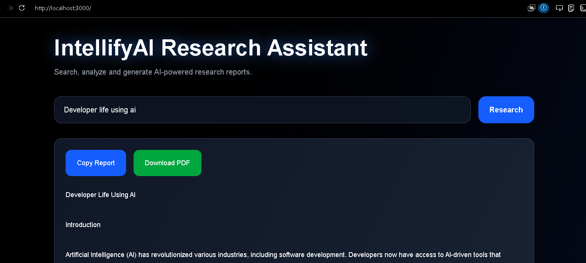
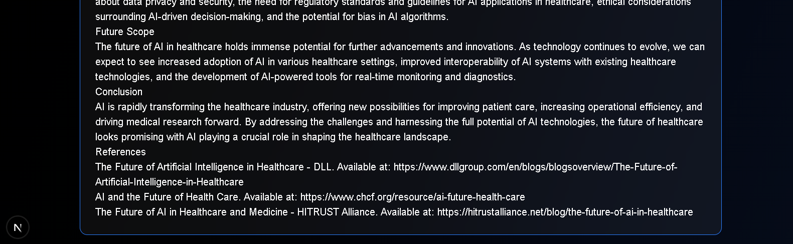
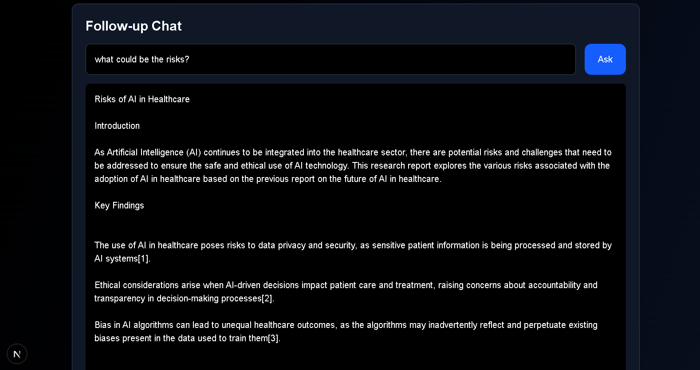

# IntellifyAI Research Assistant

An AI-powered multi-source research assistant built using Next.js, Tavily Search API, and OpenRouter.

---

## Features

- Multi-source web research
- AI-generated structured reports
- Inline citations
- Streaming typing effect
- Follow-up contextual chat
- Source references
- Modern UI

---

## Tech Stack

- Next.js
- React
- TypeScript
- Tailwind CSS
- Tavily API
- OpenRouter API

---

## Architecture

User Query → Tavily Search API → Retrieved Sources → OpenRouter LLM → Structured Report → Streaming UI Rendering

---

## Hallucination Prevention

The assistant generates grounded responses strictly from retrieved sources. The prompt explicitly instructs the LLM to avoid unsupported claims.

---

## Streaming Implementation

The frontend simulates streaming by progressively rendering text character-by-character using React state updates and intervals.

---

## Features Implemented

- Search & Retrieval
- Structured Research Reports
- Inline Citations
- Follow-up Chat
- Context Memory
- Source References
- Streaming UI

---
## Screenshots

### Home Page


### Research Report


### Research Continuation


### Follow-up Chat


### Research History


### Sources


## Setup Instructions

```bash
npm install
npm run dev
```

Create `.env.local`:

```env
TAVILY_API_KEY=your_key
OPENROUTER_API_KEY=your_key
```

---

## Demo

This project was built as part of the IntellifyAI Engineering Skill Assessment.